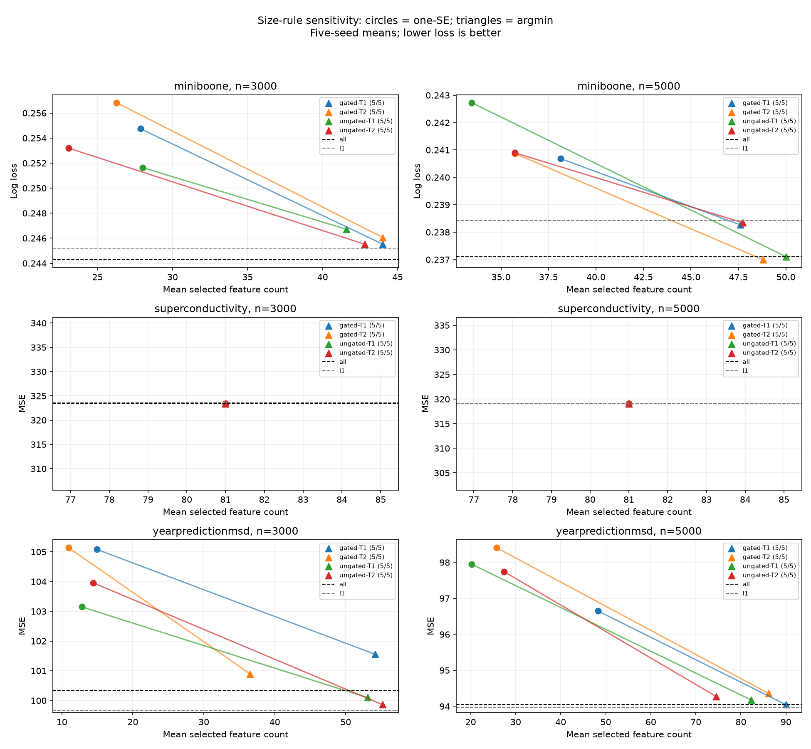

# Public selection-rule sensitivity results

Completed 2026-09-10 under the [frozen protocol](PUBLIC_SELECTION_PLAN.md), committed at `eb3a923` before public refits. Choosing the minimum inner-validation loss substantially reduced the loss associated with aggressive one-standard-error pruning in this development benchmark, at the cost of larger feature sets. This improves a demonstrated problem area; it does not establish an advantage for gating itself.

All **120 paired method comparisons** completed: three datasets, two subset sizes, five seeds, two budgets and both gated/ungated arms. Argmin reduced loss in **79**, increased it in **one**, and tied exactly in **40**. The 40 ties are all Superconductivity, where both policies selected every feature. Across MiniBooNE and Year Prediction, 79/80 comparisons improved. Sizes changed in **190/360 outer folds**.

## Accuracy improves by retaining more features

Examples below are five-seed means, with the full grid in the [24-row table](PUBLIC_SELECTION_TABLES.md). MiniBooNE uses log loss; Year Prediction uses MSE. Lower is better.

| Dataset / rows / method | Loss: one-SE → argmin | Features: one-SE → argmin |
| --- | --- | --- |
| MiniBooNE / 3,000 / gated T=1 | 0.254740 → 0.245531 | 27.87 → 44.00 |
| MiniBooNE / 5,000 / gated T=2 | 0.240871 → 0.236995 | 35.73 → 48.80 |
| Year Prediction / 3,000 / gated T=2 | 105.1374 → 100.8952 | 10.93 → 36.53 |
| Year Prediction / 5,000 / gated T=1 | 96.6498 → 94.0461 | 48.27 → 90.00 |
| Year Prediction / 5,000 / ungated T=1 | 97.9460 → 94.1764 | 20.27 → 82.27 |

Every Year Prediction comparison improved, as did 39/40 MiniBooNE comparisons. The sole increase was MiniBooNE n=5,000 gated T=2, with a seed-level log-loss increase of 0.00003368. Across the entire grid, argmin never selected fewer features. On Superconductivity all four arms retained all 81 features under both rules, so this intervention cannot improve that dataset's computation-versus-selection tradeoff.

The larger selections also overlap more across outer folds: mean Jaccard rose from 0.510 to 0.860 on MiniBooNE and from 0.300 to 0.628 on Year Prediction. These averages pool the fixed sizes, seeds and budgets within each dataset. Larger-set overlap is not evidence of more correct feature identification.

## External references and gating

L1 still has the lowest mean loss on Year Prediction at both sample sizes. At n=5,000, gated T=1 reaches the all-feature reference exactly by selecting all 90 features; it does not improve that reference. At n=3,000, ungated argmin improves on the all-feature mean but remains above L1.

The all-feature reference remains best on MiniBooNE n=3,000. At n=5,000, argmin gated T=2 has a slightly lower five-seed mean log loss than all features (0.236995 versus 0.237105), retaining 48.8/50 features. This small exploratory difference does not establish general superiority or a useful compression benefit. Superconductivity retains the original exact all-feature ties.

Among the 60 gated/ungated comparisons, argmin produces **11 gated wins, 17 losses and 32 exact ties**, compared with the original 19/21/20. Both policies use the same data and ranking budgets. The increased ties and policy-dependent ordering do not support a persistent gating advantage. For example, Year Prediction n=5,000 T=1's mean gated advantage shrinks from MSE 1.2962 to 0.1303 when ungated selection also retains more features. The [paired contrast table](../experiments/reports/public-selection-v1/contrasts.csv) reports every change in the gated-minus-ungated difference.

## Execution, validation and reproducibility

The follow-up used **720 new model fits**, **71.96 original worker-seconds** including loading/startup, and **0.272 GiB** peak process memory, with no failures or warnings. It reused the training-only rankings and inner-validation paths from the original **644,782-fit** study. Its incremental replay cost is not the cost of running either selector independently. No new importance, shadow, candidate-path or L1 fits were performed. Runtime excludes tests, analysis and resume.

Replay matched full nested execution exactly in four regression/classification and gated/ungated test cases. Public replay reproduced **all 360 original one-SE outer losses exactly**, with zero accepted float differences. Original rows, X/y hashes, feature names and nested partitions matched before fitting; size choices were recomputed from inner losses, never outer outcomes. All-feature selections reproduced the corresponding reference losses. All **145 tests** and Ruff passed. Resume preserved all 120 new method checkpoints, 180 original method checkpoints and 30 original data/fold records in both bytes and modification times.

This is a frozen exploratory intervention on development results that were already inspected, not independent confirmation. Five seeds overlap original rows and budgets share data; pooled counts are descriptive rather than independent trials. No new acceptable-loss margin, class-recall claim or default policy switch is introduced. Year Prediction's official test partition remains unevaluated. Financial data remain deferred.

The most justified next experiment is a separately frozen stress test with reproducible irrelevant features, correlated copies and controlled noise, including both selection rules and external references. It should test whether accuracy can be retained while discarding known nuisance features. The present improvement frequently sacrifices most of the dimensionality reduction.

```sh
uv sync --locked --all-extras
uv run python experiments/reproduce_public_selection.py --output artifacts/public-selection-review
```

This verifies both evidence archives and regenerates all numerical reports and figures without fitting or downloading raw data. Full refit commands are in the protocol. Counts and structure are exact; any accepted reanalysis float differences are logged under rtol=1e-12, atol=1e-14.

- [All method means and seed counts](PUBLIC_SELECTION_TABLES.md).
- [Per-seed methods](../experiments/reports/public-selection-v1/methods.csv), [outer folds](../experiments/reports/public-selection-v1/folds.csv), [gating contrasts](../experiments/reports/public-selection-v1/contrasts.csv), and [summaries with every seed and range](../experiments/reports/public-selection-v1/summary.json).
- [Frozen configuration and 42 artifact hashes](../experiments/public-selection.json).


